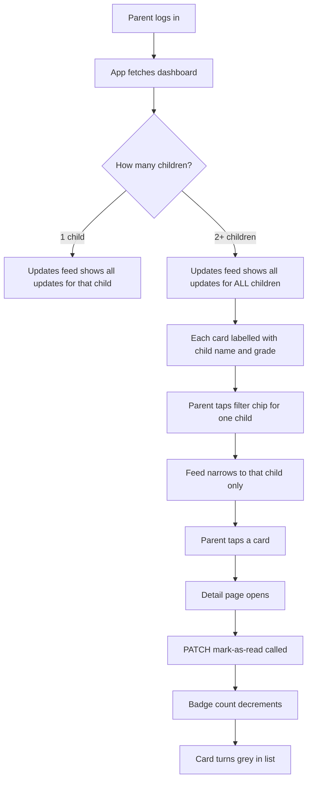

# Updates Tab — Full Feature Plan

**Document version:** 1.0  
**Last updated:** 2026-02-20  
**Scope:** Flutter mobile app (`mobile/`) + Node.js backend (`server/`)  
**Feature:** New "Updates" bottom-navigation tab for the Parent App  

---

## 1. What This Feature Does

Parents need a single place to see every communication the school or a teacher has sent them — emails, AI-generated progress reports, daily classwork updates, monthly reports, grade notifications, and any other school announcements. This is the **Updates tab**.

Key behaviours:
- A parent sees **all updates addressed to them**, across **all of their children**.
- Each update card shows which child it is about, so a parent with three children can instantly tell whose report they are reading.
- Updates are filterable by child, by type, and by read/unread status (server-side query params).
- Tapping an update opens a full detail view with the complete content.
- Unread updates show a badge count on the bottom navigation tab icon.
- Marking an update as read removes it from the unread count.

---

## 2. What Already Exists (Reuse)

| Existing piece | Where | How it is reused |
|---|---|---|
| `Notification` model | `server/models/Notification.js` | Already stores emails and reports sent to parents by email/recipientEmail. This is the single source of truth. |
| `GET /api/notifications` | `server/routes/notificationRoutes.js:30` | Existing history endpoint exists, but Updates tab uses a dedicated parent endpoint with strict student scoping. |
| `PATCH /api/notifications/:id/read` | `server/routes/notificationRoutes.js:32` | Already exists. Mobile just needs to call it. |
| `parentDashboardService.loadRecentAlertsForStudent` | `server/services/parentDashboardService.js:114` | Already fetches 3 recent alerts per child. The Updates tab needs the full paginated version of this. |
| `buildParentNotificationFilter` | `server/services/parentDashboardService.js:26` | Matches notifications by parent user ID or parent email. Reuse this exact filter. |
| `unreadNotificationsCount` | `server/services/parentDashboardService.js:202` | Already computed in the dashboard. The Updates tab badge reads from the same count. |
| Bottom navigation shell | `mobile/lib/parent/app/router.dart:145` | The `_ParentShell` already has a `NavigationBar`. A new destination is added here. |
| `_RecentAlertTile` widget | `mobile/lib/parent/features/home/parent_home_page.dart:554` | The alert tile design is already built. The Updates tab uses an expanded version of it. |

---

## 3. Data Model — What a "Update" Is

An update is a `Notification` document. The existing schema already captures everything needed:

```
Notification {
  _id
  school          → multi-tenant isolation
  recipient       → parent user _id (may be null if matched by email only)
  recipientEmail  → parent email string (used when parent has no user account yet)
  student         → which child this update is about (ObjectId ref Student)
  type            → 'ai_report' | 'daily_report' | 'monthly_report' | 'grade_update'
                    | 'daily_classwork_update' | 'announcement' | 'custom'
                    | 'attendance' | 'attendance_request' | 'attendance_request_status'
  subject         → short title shown in the list card
  message         → plain-text preview
  htmlContent     → full rich HTML content shown in the detail view
  channels        → ['email'] — how it was delivered
  status          → 'sent' | 'failed' | 'pending'
  readAt          → null = unread; Date = read
  createdAt       → sort order
  metadata        → extra data (reportId, language, reportType, etc.)
}
```

No schema changes are needed. The Updates tab reads from this existing collection.

---

## 4. Multi-Child Problem — How It Works

A parent can have more than one child. The `parentDashboardService` already solves this by finding all students where any of the three parent email fields (`fatherEmail`, `motherEmail`, `guardianEmail`) match the logged-in parent's email.

For the Updates tab, the same logic applies:

```
Step 1 — Find all children linked to this parent
         (same as getParentLinkedStudents in parentDashboardService)

Step 2 — Collect all student _ids: [childA_id, childB_id, childC_id]

Step 3 — Query Notification where:
         (recipient == parentUser._id  OR  recipientEmail matches parent email)
         AND  student IN [childA_id, childB_id, childC_id]
         AND  school == schoolId
         ORDER BY createdAt DESC
         PAGINATE with page + limit

Step 4 — Each notification document already has a `student` field.
         Populate student name + class so the card can show "Ahmed — Grade 5A"
```

This means one API call returns updates for all children, each tagged with the child it belongs to. The parent does not need to switch between children to see updates — they see everything in one feed, with each card clearly labelled.

**Optional child filter:** The parent can tap a filter chip at the top of the Updates tab to narrow the feed to one specific child. This must be a query param on the API call (`childId`) to keep pagination and totals correct.

---

## 5. Backend Plan

### 5.1 New Endpoint: `GET /api/parent/updates`

This is a parent-scoped, paginated version of the notification history.

**Route:** `GET /api/parent/updates`  
**Auth:** `protect` + `authorize('parent')`  
**Query params:**

| Param | Type | Default | Description |
|---|---|---|---|
| `page` | number | 1 | Page number |
| `limit` | number | 20 | Items per page |
| `childId` | ObjectId | none | Filter to one child |
| `type` | string | none | Filter by notification type |
| `unreadOnly` | boolean | false | Only return unread items |

### 5.2 New Endpoint: `GET /api/parent/updates/:id`

Returns full detail for one update item, including `htmlContent`, after verifying:
- the notification belongs to the authenticated parent (recipient user or exact recipient email token match), and
- the notification student belongs to one of that parent's linked children.

This avoids shipping heavy HTML in the paginated list response.

**Response shape:**

```json
{
  "success": true,
  "data": {
    "updates": [
      {
        "id": "...",
        "childId": "...",
        "childName": "Ahmed Ali",
        "childGrade": "Grade 5",
        "childSection": "A",
        "type": "ai_report",
        "subject": "Progress Report for Ahmed Ali",
        "preview": "Ahmed has shown strong improvement in...",
        "hasHtmlContent": true,
        "isRead": false,
        "createdAt": "2026-02-18T10:30:00Z",
        "sentVia": ["email"]
      }
    ],
    "pagination": {
      "page": 1,
      "limit": 20,
      "total": 47,
      "totalPages": 3
    },
    "unreadCount": 5
  }
}
```

**Implementation steps in the backend:**

1. Add a new controller function `getParentUpdates` in `server/controllers/parentController.js`.
2. Reuse `getParentLinkedStudents` from `parentDashboardService.js` to get all child IDs.
3. Build the Notification query using a strict parent filter + `student: { $in: childIds }`.
4. Populate `student` with `firstName lastName currentClass` so the response includes child name and grade.
5. Apply pagination (`skip` + `limit`).
6. Add `getParentUpdateById` for detail view (`GET /api/parent/updates/:id`) and include `htmlContent` in that response.
7. Add the routes to `server/routes/parentRoutes.js`.

### 5.3 Existing Endpoint Reuse: `PATCH /api/notifications/:id/read`

This endpoint already exists at `server/routes/notificationRoutes.js:32`. The mobile app calls it when the parent opens an update detail. No backend changes needed here.

### 5.4 Existing Endpoint Reuse: `GET /api/parent/dashboard`

The `unreadNotificationsCount` in the dashboard response already counts unread notifications for the parent. The Updates tab badge reads from this value. After marking one item read, mobile updates local unread count immediately and refreshes dashboard summary in the background to stay aligned.

---

## 6. Flutter Mobile Plan

### 6.1 New Files to Create

```
mobile/lib/parent/features/updates/
  domain/
    parent_update.dart          ← Data class for a single update item
  data/
    updates_repository.dart     ← Calls GET /api/parent/updates
  application/
    updates_notifier.dart       ← State: list, loading, error, pagination, unread count
  presentation/
    updates_page.dart           ← The tab page (list view)
    update_detail_page.dart     ← Full detail view with HTML content
    update_filter_bar.dart      ← Child filter chips + type filter chips
    update_list_tile.dart       ← Single card in the list
```

### 6.2 Domain Model: `ParentUpdate`

```
ParentUpdate {
  id: String
  childId: String
  childName: String
  childGrade: String
  childSection: String
  type: UpdateType          // enum mapped from backend Notification.type values
  subject: String           // shown as card title
  preview: String           // 1-2 line text preview
  hasHtmlContent: bool      // set from detail metadata; true when htmlContent exists
  isRead: bool
  createdAt: DateTime
  sentVia: List<String>     // ['email']
}
```

### 6.3 State: `UpdatesNotifier`

The notifier manages:
- `List<ParentUpdate> updates` — the current page of items
- `bool isLoading` — initial load spinner
- `bool isLoadingMore` — pagination spinner at bottom
- `String? error` — error message
- `int unreadCount` — badge number
- `String? selectedChildId` — active child filter (null = all children)
- `String? selectedType` — active type filter (null = all types)
- `int currentPage` — for pagination
- `bool hasMore` — whether more pages exist

Actions:
- `load()` — initial load, resets page to 1
- `loadMore()` — appends next page (called by infinite scroll)
- `markAsRead(String id)` — calls PATCH endpoint, updates local state
- `setChildFilter(String? childId)` — reloads with child filter
- `setTypeFilter(String? type)` — reloads with type filter
- `refresh()` — pull-to-refresh, resets to page 1

### 6.4 Updates Page Layout

```
┌─────────────────────────────────────────┐
│  AppBar: "Updates"   [unread badge]     │
├─────────────────────────────────────────┤
│  Filter bar:                            │
│  [All Children] [Ahmed] [Sara] [Yusuf]  │
│  [All Types] [Reports] [Grades] [Other] │
├─────────────────────────────────────────┤
│  ┌─────────────────────────────────────┐│
│  │ 🔵 Ahmed Ali — Grade 5A             ││
│  │ Progress Report                     ││
│  │ Ahmed has shown strong improvement  ││
│  │ in Math this month...               ││
│  │                    Feb 18 · Email   ││
│  └─────────────────────────────────────┘│
│  ┌─────────────────────────────────────┐│
│  │ ✓ Sara Ali — Grade 3B               ││  ← grey = already read
│  │ Daily Classwork Update              ││
│  │ Today Sara completed all exercises  ││
│  │ in Science...                       ││
│  │                    Feb 17 · Email   ││
│  └─────────────────────────────────────┘│
│  ... infinite scroll ...                │
└─────────────────────────────────────────┘
```

Visual rules:
- Unread card: left blue border accent, bold subject text, blue dot icon.
- Read card: no accent, normal weight text, grey check icon.
- Child name + grade shown in a small chip above the subject.
- Date and delivery channel shown in the bottom-right of the card.

### 6.5 Update Detail Page Layout

```
┌─────────────────────────────────────────┐
│  ← Back                                 │
│  Ahmed Ali — Grade 5A                   │
│  Progress Report                        │
│  Feb 18, 2026 · Sent via Email          │
├─────────────────────────────────────────┤
│                                         │
│  [Full HTML content rendered here]      │
│  (using flutter_widget_from_html or     │
│   a WebView for rich email content)     │
│                                         │
└─────────────────────────────────────────┘
```

When the detail page opens:
1. If `isRead == false`, call `PATCH /api/notifications/:id/read` immediately.
2. Update local state so the card in the list turns grey.
3. Decrement the unread badge count.
4. Refresh dashboard summary quietly so shell badge stays in sync with shared source of truth.

### 6.6 Bottom Navigation Changes

Current tabs in `_ParentShell`:
```
[Dashboard]  [Requests]  [Settings]
```

New tabs after this feature:
```
[Dashboard]  [Requests]  [Updates]  [Settings]
```

The Updates tab icon shows a badge with the unread count (same pattern already used for Settings in the current code — just moved to the correct tab).

Changes to [`_ParentShell`](mobile/lib/parent/app/router.dart:145):
- Add index `2` → `/updates` route.
- Shift Settings to index `3`.
- Move the unread badge from the Settings icon to the Updates icon.
- Update `_indexFromLocation`, `_titleFromLocation`, and `_navigateFromIndex` for the new index.

Changes to [`buildParentRouter`](mobile/lib/parent/app/router.dart:12):
- Add `GoRoute(path: '/updates', builder: ...)` inside the `ShellRoute`.
- Add `GoRoute(path: '/updates/:id', builder: ...)` for the detail page.

### 6.7 HTML Content Rendering

The `htmlContent` field in the Notification document contains full styled HTML (produced by `emailService.formatEmailContent`). To render this in Flutter:

**Option A — `flutter_widget_from_html` package**  
Renders HTML as native Flutter widgets. Good for simple styled content. Lightweight.

**Option B — `webview_flutter` package**  
Renders HTML in a native WebView. Handles complex CSS and email layouts perfectly. Heavier.

**Recommendation:** Use `flutter_widget_from_html` for most content. Fall back to a WebView only if the HTML is too complex (detected by checking for `<table>` or `<style>` tags in the content). This keeps the app lightweight for the common case.

---

## 7. Multi-Child Flow — End-to-End Diagram



---

## 8. Notification Types and Their Labels

| Backend `type` value | Display label in app | Icon |
|---|---|---|
| `ai_report` | AI Progress Report | `auto_awesome` |
| `daily_report` | Daily Report | `today` |
| `monthly_report` | Monthly Report | `calendar_month` |
| `grade_update` | Grade Update | `grade` |
| `daily_classwork_update` | Classwork Update | `assignment` |
| `announcement` | School Notice | `campaign` |
| `custom` | School Notice | `campaign` |
| `attendance_request_status` | Request Status Update | `fact_check` |
| `attendance_request` | Request Update | `fact_check` |
| `attendance` | Attendance Alert | `event_available` |

---

## 9. Security Rules

| Rule | Where enforced |
|---|---|
| Parent can only see updates for their own children | Backend: `student IN childIds` where `childIds` comes from `getParentLinkedStudents` using the authenticated parent's email |
| Parent can only read/mark their own notifications | Backend: verify `notification.recipient == req.user._id OR recipientEmail` contains an exact normalized email token of `req.user.email` |
| Multi-tenant isolation | Backend: all queries include `school: schoolId` from `req.school` middleware |
| No cross-parent data leakage | Backend: `buildParentNotificationFilter` uses the authenticated user's ID and email — never a query param |

---

## 10. New Dependencies Required

| Package | Purpose | Already in pubspec? |
|---|---|---|
| `flutter_widget_from_html` | Render HTML report content as Flutter widgets | No — add |
| No other new packages needed | Pagination, state, routing all handled by existing patterns | — |

---

## 11. File Change Summary

### Backend — New or Modified Files

| File | Change |
|---|---|
| `server/controllers/parentController.js` | Add `getParentUpdates` and `getParentUpdateById` controller functions |
| `server/routes/parentRoutes.js` | Add `GET /api/parent/updates` and `GET /api/parent/updates/:id` routes |
| `server/services/parentDashboardService.js` | No change — reuse existing functions |
| `server/routes/notificationRoutes.js` | No change — `PATCH /:id/read` already exists |

### Mobile — New Files

| File | Purpose |
|---|---|
| `mobile/lib/parent/features/updates/domain/parent_update.dart` | Data class |
| `mobile/lib/parent/features/updates/data/updates_repository.dart` | API calls |
| `mobile/lib/parent/features/updates/application/updates_notifier.dart` | State management |
| `mobile/lib/parent/features/updates/presentation/updates_page.dart` | Tab page |
| `mobile/lib/parent/features/updates/presentation/update_detail_page.dart` | Detail view |
| `mobile/lib/parent/features/updates/presentation/update_filter_bar.dart` | Filter chips widget |
| `mobile/lib/parent/features/updates/presentation/update_list_tile.dart` | Single card widget |

### Mobile — Modified Files

| File | Change |
|---|---|
| `mobile/lib/parent/app/router.dart` | Add `/updates` and `/updates/:id` routes; add tab index 2; shift Settings to index 3 |
| `mobile/pubspec.yaml` | Add `flutter_widget_from_html` dependency |

---

## 12. Phased Delivery

### Phase 1 — Backend endpoint + basic list (no HTML rendering)

- [ ] Create `getParentUpdates` controller
- [ ] Add `GET /api/parent/updates` route with pagination and child filter
- [ ] Add `GET /api/parent/updates/:id` route for full detail (`htmlContent`)
- [ ] Create `ParentUpdate` domain model in Flutter
- [ ] Create `UpdatesRepository` calling the new endpoint
- [ ] Create `UpdatesNotifier` with load + pagination
- [ ] Create `UpdatesPage` with basic list tiles (no HTML detail yet)
- [ ] Add Updates tab to `_ParentShell` and router
- [ ] Wire unread badge to `unreadNotificationsCount` from dashboard

**Exit gate:** Parent can open the Updates tab and see a paginated list of all updates for all their children, each labelled with the child's name.

### Phase 2 — Detail view + mark as read

- [ ] Add `flutter_widget_from_html` to pubspec
- [ ] Create `UpdateDetailPage` with detail fetch + HTML rendering
- [ ] Wire `PATCH /api/notifications/:id/read` on detail page open
- [ ] Update local state to reflect read status (grey card, badge decrement) and refresh dashboard unread count
- [ ] Add child filter chips and type filter chips

**Exit gate:** Parent can tap any update, read the full content, and the unread badge decrements correctly.

### Phase 3 — Polish

- [ ] Pull-to-refresh on the Updates list
- [ ] Empty state illustration when no updates exist
- [ ] Error state with retry button
- [ ] Offline cache: store last 50 updates in Hive so the list is visible without network
- [ ] Accessibility: ensure all cards have semantic labels for screen readers

---

## 13. Open Questions (Decisions Needed Before Implementation)

| Question | Options | Recommendation |
|---|---|---|
| Should the Updates tab show updates that failed to send by email? | Yes — show all / No — only successfully sent | Show all; add a "Failed to deliver" badge on failed ones so the parent knows |
| Should the parent be able to delete/dismiss an update? | Yes / No | No for now — keep it as a read-only inbox |
| Should updates older than 1 year be hidden? | Yes / No | Add a default date filter of current academic year, with option to see older |
| HTML rendering: `flutter_widget_from_html` vs WebView? | See Section 6.7 | Start with `flutter_widget_from_html`; switch to WebView if layout breaks |
| Should unread badge represent all unread notifications or only updates feed filters? | All parent unread / filtered unread | Use all parent unread for nav badge (shared with dashboard) |
